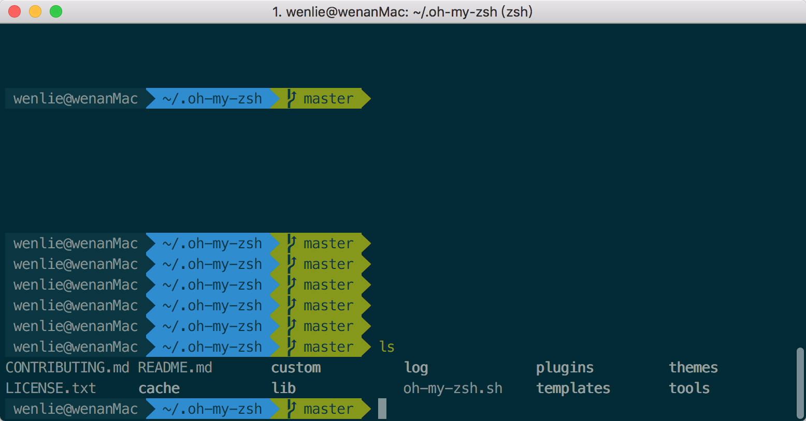
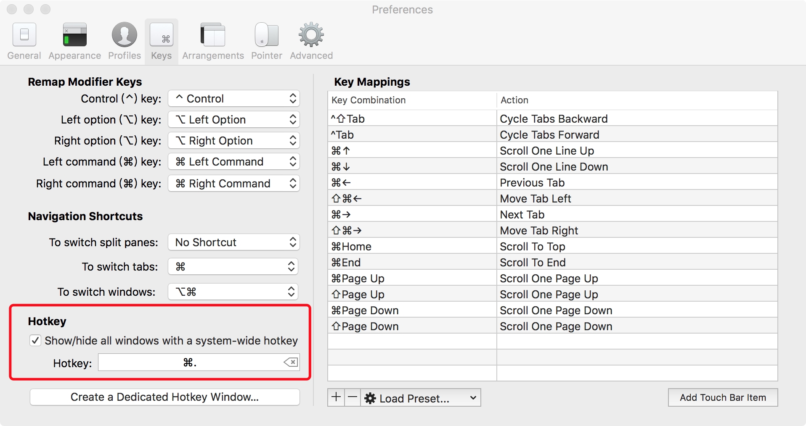

## 打造酷炫的Mac终端


最近总结了一下Mac下的终端配置，先截图看下目前的终端效果。





目前拥有语法高亮，命令行tab补全，自动提示符，显示Git仓库状态等功能。


### 安装iTerm2

iTerm2比Mac自带的终端更加强大，重点是不要钱。直接官网 <http://iterm2.com/> 下载并安装即可


#### 配置iTerm2

安装完成后，强烈建议将iTerm2设置为*默认终端*。


然后打开偏好设置Preference，选中Keys，勾选Hotkey下的Show/hide all windows with a system-wide hotkey，将热键设置为`command + .` ，这样你就可以通过`command + .` 全局热键来打开或关闭iTerm2窗口。





### 配色方案


尝试了一下 [solarized](http://ethanschoonover.com/solarized)，效果还不错。进入官网，下载并解压后，打开 iTerm2 下的偏好设置 Preference ，点开 Profiles 下的Colors 选项，点击右下角的 Color Presets 选项，选择Import ，导入解压到的 solarized 文件下的Solarized Dark.itermcolors。


### 安装oh-my-zsh

打开oh-my-zsh的github主页: <https://github.com/robbyrussell/oh-my-zsh>

按照说明安装oh-my-zsh


#### 设置oh-my-zsh的主题

安装成功后，`vim ~/.zshrc` 打开配置文件，修改主题为`agnoster`


```
ZSH_THEME="agnoster"
```


应用这个主题需要特殊的字体支持，否则会出现乱码情况。

1. 下载安装 [Meslo](https://github.com/powerline/fonts/blob/master/Meslo%20Slashed/Meslo%20LG%20M%20Regular%20for%20Powerline.ttf) 字体
2. 应用字体到 iTerm2 下，`iTerm2 -> Preferences -> Profiles -> Text -> Change Font`


到这一步，已经有点样子了。接下来，我们安装一些实用的插件。


### 自动提示命令

现在，安装 `zsh-autosuggestions` 插件，让命令提示飞起来。


1. 下载插件。
   `git clone git://github.com/zsh-users/zsh-autosuggestions $ZSH_CUSTOM/plugins/zsh-autosuggestions`
2. `vim ~/.zshrc`，找到命令配置，将`zsh-autosuggestions` 添加进来。
   `plugins=(zsh-autosuggestions git)`
3. 重启 iTerm2


为了让提示信息更明显，可以修改一下字体颜色。具体操作如下:

vim 打开 `zsh-autosuggestions.zsh` ，修改配置为 `ZSH_AUTOSUGGEST_HIGHLIGHT_STYLE='fg=10'`


### 语法高亮插件

1. 安装`zsh-syntax-highlighting`
   `brew install zsh-syntax-highlighting`
2. 配置.zshrc文件
   `source /usr/local/share/zsh-syntax-highlighting/zsh-syntax-highlighting.zsh`
3. 让配置生效。`source ~/.zshrc`


好了，现在我们的终端应该已经6到飞起了。


